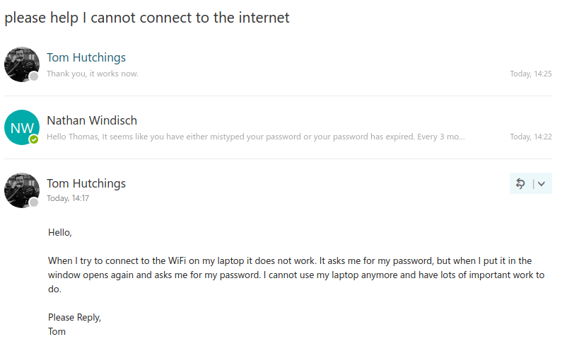
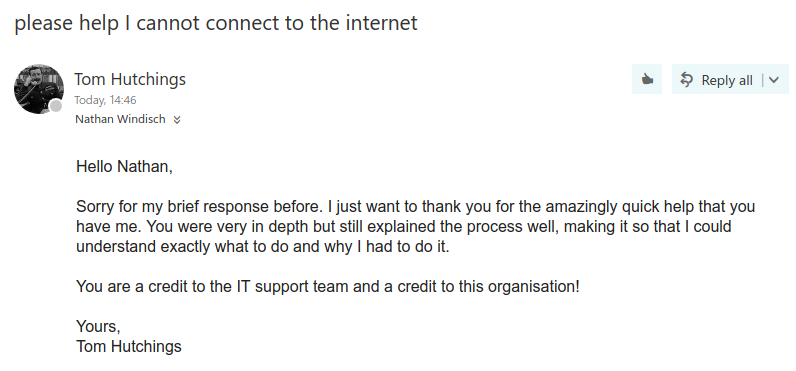

# Unit XII Assignment II
*By Nathan Windisch*

## PIV: Technical Information via Fault Logs
The following is a list of technical support issues that I was presented with from the 19th May to 23rd May
| Date | Fault | Resolution | Information Links |
|-|-|-|-|
| 19/May/17 | BIOS had a password | Removed and reset the CMOS battery | `https://.computerhope.com/issues/ch000235.htm` |
| 20/May/17 | Laptop was slow | Removed programs that were starting on user login | `https://kb.iu.edu/d/adlf`
| 20/May/17 | User could not connect to the WiFi | Reset user's password and had them login again | `https://windowsforum.com/threads/wpa2-enterprise-possible-password-recovery.77324/`
| 23/May/17 | Battery would not recharge | Used warranty to get a new working battery and replaced it | `http://dell.com/downloads/emea/services/ie/en/nbd.pdf` |

## PV: Providing Advice and Guidance
The following images show an email converse between myself and an end user about an issue. The issue in question occurred on 20th May 2017. Thomas Hutchings, a receptionist, could not log into the WiFi via their laptop. They could connect but the system would reject their username and password, so I reset their password and told them to try to log back in, at which point they had to type in a new password. After this they could access the Internet, as seen in the images below.

## PVI: Email Responses
The following email is a more in-depth email thanking me for my assistance.

## PVII: Expanded Fault Logs
The following segment is an expert from my full faults logs which are much more expanded and accurate, in comparison to the previous logs which were more of a summary.

> #### Date
> 20th May 2017
> #### Issue
> The user could connect to the WiFi but they could not access any web pages due to the fact that they were not logged into the system.
> #### Solution
> The fix was to ensure that the user's password was reset, in order to let the user reset their password and log back in again with their new password. I issued them a temporary password that would expire once they logged in and the system automatically prompted them to set a new one. The new temporary password in question was their first name, followed by their surname, followed by the numbers 4, 5 and 6.
> #### Information Links
After a bit of searching, I found out that the WiFi system that we are using is officially classed under WPA-Enterprise. This means that each user on the system can have different levels of access to the system, all password protected. I found out how to reset a user's password from our internal, NDA'd documentation and I used the following thread to initially find out about WPA-Enterprise: `https://windowsforum.com/threads/wpa3-enterprise-possible-password-recovery.77324/` See `{Appendix I}` for a mirror.

## MIII: Source Material Value and Appendices
### Appendices
In the previous segment, I used an Appendix to ensure that the page could still be accessed even if the website `windowsforum.com` goes down for whatever reason. I used the website `archive.is` to take a snapshot of the webpage to be able to view it at a later date if required The appendix is as follows:

Appendix I: http://archive.is/f3JVF

### Values of Source Material
#### Cross Referencing
When looking at source material it is always important to cross reference it to ensure that the data is valid and secure. Cross referencing is best used when looking at multiple credible sources and ensuring that they all say either the same or similar things. Once this is done, it is always good to reference every source that you have come across that validates your points and place them all in various appendices.

#### Legitimacy and Valuing Data
Just because many difference sources show that data is similar to one another, does not mean that they are all correct. All data should be internally validated and some common sense should be used in order to ensure that the data is all present, correct, accurate and valid. A good example of this in recent times is the school of thought that vaccines caused autism. There were a few different scientific journals that stated this, but that have since been discredited. Sadly, due to the populaces inability to process new, conflicting information the fact that this data was falsified did not seem to have much of an affect on those who believed otherwise. Because of this, there have been cases of children dying due to being infected by diseases that they should be vaccinated against.

## MIV: Common Faults and How To Solve Them
The following are some common faults that many users come across but do not know how to solve easily, luckily I shall include some simple guides and tips to solving these issues.

### Forgotten Password
If you have forgotten your password, there are a few different things that you can do. The first is to press the `Recover Password` button and attempt to reset your password by the email that you are sent via either clicking on the link or entering the temporary password that you have been given. If you do not have access to this email then you could try to request a password reset from the system administrator, if you can contact them personally. A good way to prevent this is to have a password manager such as `LastPass`, which will save all of your passwords and allow you to generate new secure ones, all secured behind a master password.

### Computer Is Slow
If you computer is slow then you could try to defragment your disk. If you are on Windows, then you can press `Win+R` and type in `defrag`, then follow the instructions to lower the amount of files on your system and to make sure that they are not corrupt or damaged. Another good idea is to stop programs from loading on startup, and this can be done by going into your Task Manager by pressing `Control+Shift+Escape` and setting all programs that are in the "Startup" tab to be false.

### Wipe Files
To wipe your files on a Windows machine, a good first step is to format your drive(s). This can be done by opening the File Explorer with `Win+E` and right clicking on the drive that you want to wipe, then selecting `Format...`. There are some more advanced utilities out there that can make your data utterly unrecoverable.

## DII: 
