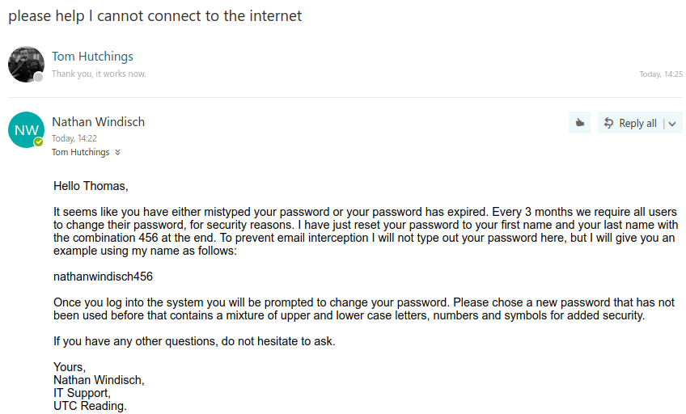

# Unit XII Assignment II
*By Nathan Windisch*

## PIV: Technical Information via Fault Logs
The following is a list of technical support issues that I was presented with from the 19th May to 23rd May
| Date | Fault | Resolution | Information Links |
|-|-|-|-|
| 19/May/17 | BIOS had a password | Removed and reset the CMOS battery | `https://.computerhope.com/issues/ch000235.htm` |
| 20/May/17 | Laptop was slow | Removed programs that were starting on user login | `https://kb.iu.edu/d/adlf`
| 20/May/17 | User could not connect to the WiFi | Reset user's password and had them login again | `https://windowsforum.com/threads/wpa2-enterprise-possible-password-recovery.77324/`
| 23/May/17 | Battery would not recharge | Used warranty to get a new working battery and replaced it | `http://dell.com/downloads/emea/services/ie/en/nbd.pdf` |

## PV: Providing Advice and Guidance
The following images show an email converse between myself and an end user about an issue. The issue in question occurred on 20th May 2017. Thomas Hutchings, a receptionist, could not log into the WiFi via their laptop. They could connect but the system would reject their username and password, so I reset their password and told them to try to log back in, at which point they had to type in a new password. After this they could access the Internet, as seen in the images below.

## PVI: Email Responses
The following email is a more in-depth email thanking me for my assistance.

## PVII: Expanded Fault Logs
The following segment is an expert from my full faults logs which are much more expanded and accurate, in comparison to the previous logs which were more of a summary.

> #### Date
> 20th May 2017
> #### Issue
> The user could connect to the WiFi but they could not access any web pages due to the fact that they were not logged into the system.
> #### Solution
> The fix was to ensure that the user's password was reset, in order to let the user reset their password and log back in again with their new password. I issued them a temporary password that would expire once they logged in and the system automatically prompted them to set a new one. The new temporary password in question was their first name, followed by their surname, followed by the numbers 4, 5 and 6.
> #### Information Links
After a bit of searching, I found out that the WiFi system that we are using is officially classed under WPA-Enterprise. This means that each user on the system can have different levels of access to the system, all password protected. I found out how to reset a user's password from our internal, NDA'd documentation and I used the following thread to initially find out about WPA-Enterprise: `https://windowsforum.com/threads/wpa3-enterprise-possible-password-recovery.77324/` See `{Appendix I}` for a mirror.

## MIII: 

## MIV:

## DII: 
