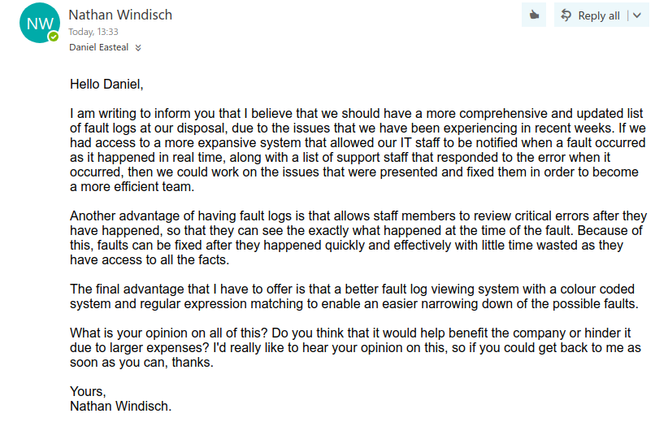

# Unit XII Assignment I
*By Nathan Windisch*

## PI: Tools and Techniques Used in IT Support
There are a few different tools that can be used within IT Support, and I shall list some of them and the technique that they are used in

### Virtual Network Computing
Virtual Network Computing, or VNC, is a method for IT Support Technicians to be able to access client's computers from all over the world. The technology that it uses is the ability to view and interact with a computer across the Internet. This usually includes access to view the monitor and manipulate the keyboard and mouse, but it can also allow the Technician access to listen to the sound output of the system, view video feed from peripherals such as webcams, and listen to or even manipulate the sound input to the system via a microphone. Two main services used for VNC are TeamViewer, which is an industry standard in technical support operations, and Join.Me, a relatively new player in the field with a much easier user interface. Both have free plans, but if a business wants to utilize all the tools available to them then they should purchase a business licence of some sort. I would recommend going to either <a>teamviewer.com</a> or <a>join.me</a>.

### VoIP Communication
Another key tool that IT Support Technicians have at their disposal is Voice Over Internet Protocol, or VoIP. This allows Support Engineers to communicate with clients quickly, easily and clearly without the need for extensive setup times. The client simply needs to download the program and connect to the server, in most cases. There are a few main contenders for VoIP communication, the first being Skype by Microsoft. Skype is the most well known program out of my three examples, but it is normally used by private citizens for communication between friends and family, or Skype Business which is commonly used in internal systems in large companies as a fast and secure VoIP and IM (Instant Messaging) application. Another piece of software that can be used is TeamSpeak3, which is a server based model rather that peer-to-peer which is what Skype is. With TeamSpeak3, the client connects to a server and can then speak to everyone connected to that server, as long as they have the correct permission nodes and are in the correct voice channels. A positive to using TeamSpeak3 over Skype is that it runs on a server based model with clients connecting to one IP address or domain name, making it more centralised. A downside to using TeamSpeak3 is that it is much less known than Skype, meaning that less users will have it. Also, the setup process for TeamSpeak3 is relatively long, which may put clients off. The final piece of software that I shall be discussing in this segment is Discord, which is a free desktop, mobile and web application with both a graphical and command line user interface. Discord is primarily used in the PC video gaming community, but due to the fact that it has a web application it can be easily installed and utilized by anyone. While Discord uses a server-based model, it allows users to join servers to talk to large numbers of people or once, while still letting users add each other as contacts and calling them, imitating the peer-to-peer aspect of Skype without the possible security risks of the latter. Discord servers can also be much more easily accessed, as an invite link can be set to permanent and then an easier web link can be set to redirect to it. The final benefit of Discord is that it allows for users to access it via the web, reducing setup time. The websites for these tools are as follows: <a>skype.com</a>, <a>teamspeak.com</a> and <a>discordapp.com</a>

### Defragmentation
As a computer gets used more and more, the disk will access commonly used files again and again. This can result in the file being spread and cloned around the hard drive for easier access. While this may sound like a good idea, this can clog up a system and slow everything down. A way to remedy this is to use Disk Defragmentation software. Within Microsoft's Windows there is a built in defragmentation software that can be found by pressing the Start Key and typing in "defrag". This software will remove any excess files. Another thing that this software does is remove any corrupt files or excess bytes left behind when moving around files. It is important to note that this software will only really work on Hard Disk Drives, or HDDs, due to the method that they store data as they are physical disks, whereas Solid State Drives, or SSDs, will not work as they are merely expanded flash memory and, as such, cannot have any real difference when defragging them. In fact, due to the way that SSDs work, they have a large but limited number of writes. This means that when defragging a Solid State Drive you can actually be doing more harm than good. Also, due to the way that the `ext`, the main file system that many Linux distributions use, there is no real point in running a defragmentation tool as it will not create much of a performance boost, whereas Windows' NTFS can be more prone to fragmentation, meaning that it will have a greater effect. For more information on Windows' Defragmentation, I would recommend checking out the official support page at <a>support.microsoft.com/en-us/help/17126</a>

### Spam Removal
Another common weapon in a Technical Support Agent's arsenal is the ability to critically find spam, useless or otherwise miscellaneous files and remove them. A common method is for the Technical Support Agent to get the user to place any locations of files that they think may be important into a text file, so that they can be backed up, including a list of commonly used software. The technician will then clone all of this data onto a secondary hard drive and keep them safe, before 'nuking the system from orbit' or wiping all files on the system. This will speed up the system tremendously due to the fact that only the essential software and files will be on the new system. For more information about wiping disk drives, check <a>pcworld.com/article/261702/</a>

### Software Diagnostics
There are a few different types of diagnostics checks that the Support Agent can perform, but the most common is an AntiVirus scan. Windows has a built in virus scanner called Windows Defender which is quite good as a daily driver, but users should be advised to obtain more advanced software if they can. A good free antivirus software is MalwareBytes, which updates it's dictionary daily to ensure that the latest threats are prevented. A dictionary is a list of possible file names, sizes and types that have been known to have viruses or miscellaneous code within them. A virus which has not yet been discovered is called a "zero day vulnerability". The following is a link to MalwareBytes: <a>malwarebytes.com</a>

### Hardware Diagnostics
Hardware Diagnostics are harder to perform via the Internet, as they deal with the physical system. Because of this, some companies deal solely with hardware diagnostics, maintenance and repair. The main tool used in a hardware diagnostic is a multimeter, which allows the user to check the voltage, resistance and current of the wire that they are currently inspecting.

### Task Manager
If there is a process that is using up a lot of system resources, then a Task Manager can help find it and help terminate it. In Windows, the Task Manager is called just that, and can be accessed by pressing `Ctrl+Shift+Esc`. This dialog can show all of the processes on the system, and can be used to sort by different measures such as CPU usage, RAM usage, Disk usage and Network usage. The System Engineer can then search up on what the nefarious process is and potentially kill it, after which they can find a fix for it and deal with the problem then. On many \*nix based systems there is a program called `top` which is similar to Task Manager, but a Command Line Interface. A more updated version, `htop`, is available in most package managers. The following is a link to the official page about HTOP: <a>hisham.hm/htop/</a>

## MI: Importance of Keeping Fault Logs
The following is an email transcript between myself and my colleague Daniel Easteal about Fault Logs:

</img>

## DI: Updating Support System Technology
One technology that has broken the surface of the technical support world is Group Policy. Group Policy is a way for Systems Administrators to be able to manage all devices on their site that are running Microsoft's Windows. Group Policy allows for the basics such as a permissions system to block access to certain applications or websites to ensure security and productivity. An example of this is the ability to block Command Prompt and Power Shell to ensure that the user cannot edit any of the system settings or any of the other user's documents. The Group Policy can also prevent users from accessing certain areas and drives. A good example of this would be if users save all of their data on the cloud, they should not have access to the C drive to ensure that no viruses or other malicious software are installed on the system. Also, if there are multiple network drives for each department, they should not have access to one another. Group Policy can also block certain websites or words within URLs to ensure that no inappropriate, illegal or otherwise distracting websites are being viewed at the workplace. This is to prevent any possible legal issues if an employee views illegal content on the company's system, as all of the websites that a user visits can be tracked and logged to ensure that the blame is correctly shifted to the employee that accessed the website rather than the company due to the fact that there was no logs to prove it otherwise. Group Policy can also allow for directory redirection, meaning that users can go to what they believe to be their home folder on their local drive, when in fact they are accessing the network drive in the cloud. This makes the system easier to use for new employees die to the fact the they do not have to navigate to a new drive that is hard to access and, instead, they cam just access what seems to be their home drive, thus simplifying the process.

Another highly important thing that Group Policy can do is update all software at once. This means that the users do not have to be relied on to perform updates themselves, and the Systems Administrators do not have to go to each device individually and update them manually, rather they can just update one computer, test it extensively and then role out the update to all devices that are connected via the group policy, as long as the data is within the update repository. As Group Policy is a Microsoft Window's product, all versions of Windows should be within this list. If a program is not within the repository, then a Systems Administrator can silmply upload the installer executable to the server and forcfully run it on all machines. The only downside to this system is that if the software has not been properly tested then malicious code could be injected into all devices on the network.
