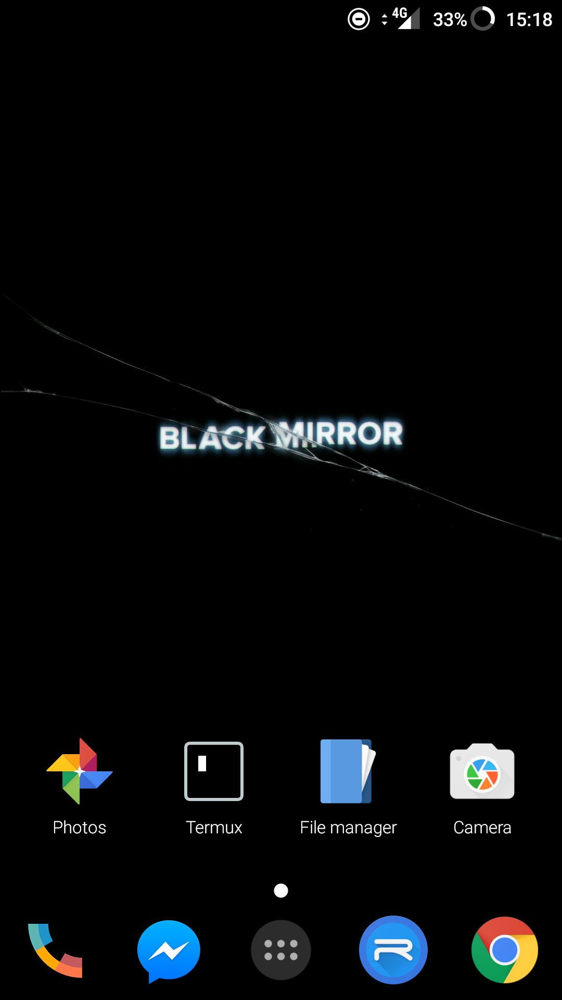

# Unit XIV Assignment I
*By Nathan Windisch*

## PI: Features of Event Driven Programming
### What is Event Driven Programming?
Event Driven Programming is the usage of events to define the outcome of the program. Events can be actions performed by the user, such as mouse clicks or key presses, inputs from sensors, or from calls sent by another thread. This means that the most programs that are written today that have some sort of user interactive feature are based on code that is event driven, due to the fact that having actions that respond to the user are inherently event driven. The following are some examples of programming languages that utilize event driven architecture:
* Java
* Visual C++
* Visual Basic
While all of these programing languages are similar and can do the same things, some are better suited to certain tasks than others. For instance, Visual Basic is better suited for entry level programming as it can make quick GUI based programs for easy access. Visual C++ is used for powerful but small programs that need to either work fast or work on systems with low amounts of resources such as embedded systems. This includes clocks in washing machines and microwaves, for example. Java is a more general purpose language that is used for making programs with high levels of compatibility as it works across many devices without the need of rewriting any code.

### What Are Event Driven Systems
Event Driven Systems are programs that have are based around the input that the user gives. Based on this, a specific output is devised and shown to the user. An example of this could be a calculator program that switches between a simple calculator layout and a more complex, scientific calculator layout. Event Driven Systems are incredibly useful for large corporations as they can perform complex functions with little user input, such as adding information to a database or retrieving certain parts of a file, both of which would need long commands such as `SQL` or `grep`. Event Driven Systems are especially useful for embedded systems such as sprinker systems which will need to retrieve if the internal temperature of the building is too high, or if a fire alarm has been pressed.

### Service Orientation
Service Orientation is used in event driven programing as a way to ensure that only a small amount of system resources are used by specific programs. This means that applications and features that run in the background do not need to take up large chunks of CPU or RAM usage, meaning that the total uptime of the system will be increased as these parts of the system do not need to be run 24/7. A good example of an application that takes advantage of Service Orientation are drivers, which are installed in the background whenever a new device that needs them is installed, ensuring that new physical devices can work properly on the fly. These services that install these key DLL files are very small and are only called when used, meaning that they are event driven as they are only used when needed.

### Time Driven
Time Driven functions are sections of code that are run on a timely basis, such as every hour or twice a week. These are very useful for automated systems that need to perform nightly backups, as no systems administrator needs to be there in order to start the process, it does it automatically based on the system's internal clock. Another good usage for Time Driven code is when performing Operating System update checks, as it means that the system runs independent of the central server. This can mean that user updates are staggered, if the user base is large, to prevent to many connections accessing one specific file or group of files, such as an Operating System upgrade.

### Trigger Functions
Trigger functions are the core part of event driven programming. They are called when specific actions are run, and many different trigger functions can be assigned to one specific action. An example of this could be an automated door system. During the day, the automatic doors open when the sensor is tripped but when the doors are locked during the night time the doors will not open. If the sensors in the doors motors sense that the door is being opened by force while locked, the local law enforcement could be called and notified of a possible break in. If the door is in "secure" mode then it can only be opened by RFID cards which are scanned onto the reader next to the door. This bypasses the lock and does not notify law enforcement.

### Events
#### Mouse Events
Mouse Events can be triggered when the mouse moves into a certain position on the screen, or if a certain area is clicked. Also, when the scroll wheel is moved either up or down could trigger an event, along with the forwards and backwards buttons being pressed on the side of the mouse.

#### Keyboard Events
Keyboard Events can be triggered when any key on the keyboard is pressed. An example of this is that when `F1` is pressed then a help message is normally displayed to the user. When the up and down keys on the keyboard are pressed, the page may change position. This can also be configured to use the `VI` and `VIM` keybinds, which are `H` for left, `L` for right, `J` for up and `K` for down.

#### Forms and UI
In Microsoft's `Windows`, Forms are objects that open a specific application when activated. An example of this is your home directory being opened when "My Computer" is pressed. Another example is that when the user presses on the "Google Chrome" shortcut is pressed, the internet browser opens. Forms are incredibly useful to the user experience, or UX, as it allows for programs and features to be accessed with ease, without the use of the command line interface.

#### External Events
External Events are called when a user requests that a program opens a specific file type, such as `Okular` opening the .pdf file type by default.

### Event Loops
Event Loops are called when a specific event needs to run multiple times in quick succession. An example of this is when a user enters in some text into a form that is not the correct data type, then the system should report to the user that an error occurred until the user fixes it.

### Flexibility
Event Driven Program is extremely flexible as the code is based around events rather than things being hard coded into the program. This means that the code should work relatively with hundreds of lines missing, as long as each individual code block is complete.

### Suitability for Graphical User Interface
Event driven programs are especially suitable for Graphical User Interfaces, or GUIs, due to the fact that GUIs are mainly based around events such as mouse clicks and keyboard presses. GUIs can also have games and other programs running on them, most of which are event driven.

### Simplicity of Programming and Ease of Development
Event driven programming languages are good or developers as many teams of people can work on different things and they will not break each other's code due to the fact that each block of code runs off events rather than one another. They are also much more simple to program as code blocks should generally not fully interact with one another, meaning that lots of event driven code is module based. Also, there are many debugging tools that allow developer to find errors in their code quickly and easily.

<div style="page-break-after: always"></div>

## PII: Tools and Techniques of Event Driven Programming
### Key Press
#### Definition
A key press is when a user presses a key on a keyboard. In event driven programming, key presses are vital to be able to intercept as it allows users to manipulate the program.

#### Example
The following is a semi-pseudocode example of how intercepting a keypress would work:
```
if (keypress == 'w' || keypress == 'W') {  //  Execute if the user presses the 'w' character OR if the user presses the 'W' character while holding the shift modifier.
	player.move(forward); //  Moves the player forward.
}
```

### Mouse Click
#### Definition
A mouse click is when a user clicks a button on the mouse. Like keypresses, this is very important in video games where the user uses the mouse.

#### Example
The following is a semi-pseudocode example of how intercepting a mouse click would work:
```
if (mouseclick == 'LeftClick') {  // Executes if the user clicks the left mouse button.
	player.attack();  // Makes the player attack.
}
```

### Touch Screen
#### Definition
Touch Screen are becoming increasingly more used due to mobile phones being used more often. Touch screens are one of the only inputs found on mobile phones, meaning that lots of things need to be able to be done with them in order to bring them up to speed with modern desktop computers.

#### Example
The following is an example of a touch screen on a mobile phone.


### Menus
#### Definition
A menu is a method of displaying extended information to a user. Menus can be categorized to give users a basic output, but allow them to focus into more detailed parts of the program if they want to.

#### Example
The following is an example of a menu found within Google Chrome.


### System Event
#### Definition
A system event is when the operating system notifies the user of an important action that they need to act on. An example of this is if an application needs to access more permissions.

#### Example


### Variables and Constants
#### Definition
Variables are arguably one of the most important parts of programming. They allow developers to store information within the program, either hard coded or on the fly when the user interacts with the system.

Constants are similar to variables but cannot be changed by the user or any code once it has been instantiated. It is for constant values that never change.

#### Example
The following is a `C#` example of how a variable is stored. I have used every single primitive variable type that is available, and I shall discuss them in more depth in the next segment.
```
var x = 123;
var y = "a cat";
var z = true;
var a = 3.14F;
var b = 13.37;
var c = 'g';
```

#### Scope
There are two different types of scopes that variables can use, local and global. Local variables are only accessable within certain areas, such as specific functions or classes. This means that you can resuse the same variable name over and over and the data will not conflict. It also means that you can ensure where the data is stored, meaning that 

### Data Types and Arrays
#### Definition
There are many different types of Data Types, and I shall list them and give each one a basic description. Please note that there may be more, obscure data types out there, but I shall just list the main ones that can be found within commonly used programming languages such as `C#`, `Java` and `Python`.

* Integer: A whole number that can be a maximum of 32 bits in size.
* String: Words stored as text, can include single letters or numbers, but they will be stored as text and cannot be manipulated as letters or numbers.
* Characters: Single letters.
* Booleans: Either a true or false value.
* Double: A number that can have a decimal value that can be a maximum of 64 bits in size.
* Float: Similar to a double, but cannot store as many numbers and MUST have an 'F' at the end of the value that can be a maximum of 32 bis in size.
* Byte: An integer that is very small that can be a maximum of 8 bits in size.
* Short: An integer that is quite small that can be a maximum of 16 bits in size.
* Long: Similar to an integer but can have much larger values.

An array is a group of data that is all stored within one location. Arrays normally only store one specific data type, but can store multiple arrays within themselves. These are called multi-dimensional arrays.

#### Example
```
int a = 10;
string b = "Hello, world!";
char c = 'c';
bool d = true;
double e = 3.14;
float f = -13.37F;
byte g = 3;
short h = 467;
long i = 34325;
```

```
int[] j = [ 1, 3, 5, 7, 9, 11 ];
int[][] k = [ [ 0, 2, 4, 6, 8, 10], [ -0, -2, -4, -6, -8, -10 ] ];
```

### Loops
#### Definition
A loop is a sequence of code that is repeated for a specified number of times, or until a specific condition is reached. One thing that loops are used for is constantly repeating code until the program is stopped, but another thing that it is used for is increasing variables within the function.

#### Example
The following is an example of a `for` loop which repeats until the conditions (the second argument) is met.

```
for (int i = 0; i >= 10; i++) {
	Console.WriteLine("The loop will run for another " + (10 - i) + " times.");
}
```

The following example does the same as the previous one, but uses a `while` loop rather than a `for`.
```
int i = 0;
while (i >= 10) {
	Console.WriteLine("The loop will run for another " + (10 - i) + " times.");
	i++;
}
```

<div style="page-break-after: always"></div>

## MI: Event Driven Operating Systems
### Justification
All Operating Systems are event driven due to the fact that they all take a user input and supply an output once certain conditions are met. For instance, when the user logs in the operating systems checks if they are a valid user, if their password is correct and what their user settings are. It then logs them into the system and sets their settings to be the same as those stored in the Hard Drive. An example of an event driven operating system is Windows 10 by Microsoft. Another example is OSX by Apple. Many programs that you will use in both of these operating systems have things that you can click on and interact with, such as prompts and menus.

### Examples
#### Start Menu
A better example of this is the Start Menu in Windows 10. You can either click the button in the bottom left hand side of the screen to open it, or you can press the Windows key on your keyboard. Please note that the Windows key can also be referred to as the *Super Key* or the *Hyper Key*.


#### Drag 'n' Drop
Another example of event driven code within operating systems is the "Drag 'n' Drop" feature. This allows the user to move files between places without entering complex commands such `mv` or `cp`.


#### External Drives
Another example is plugging in an external drive, as it has to install the drivers if they are not there already and present the user a dialog so that they can interact with the external drive.


### Advantages
An advantage of an event driven operating system is that it allows the user to perform complex tasks without much effort. They can use the keyboard and mouse to navigate the system and can execute code without typing a single thing into the command line interface. Event driven operating Systems are much easier to program that non event driven ones, due to the fact that it can be built in a very modular fashion, meaning that the users and the distributors can pick and choose what features are right for them. Object orientated code will also allows processes to be run on multiple threads, meaning that the code can run much quicker as new actions do not have to wait for the previous ones to complete. This also means that the operating system will be written with modern programming languages with object orientation and good documentation that is extremely scalable, such as `Java` or `C#`. This means that the operating system will be much more efficient, meaning that it will run faster.

A final advantage is that when you are using an event driven programming method for an operating system then you can easily have all of the windows and menus act as an object and then you can have all the similar ones get the attributes of a template for its type as mentioned in an earlier section, this will therefor ensure that there is less redundancy in the system and so the code will therefor be smaller. In addition to this, this also allows for when the time comes to update the system having a simpler process as you will then only have to update the windows group with the new attributes and then all the windows that will be created will have the new update applied, this will then be system wide immediately.

### Disadvantages
One disadvantage is that if the operating system is not a modular system then when things are changed in one event handler then many other things may break, such as the desktop breaking if the login manager is changed, for instance. Another thing that is a definite disadvantage to creating an event driven operating system is that code cannot really be executed on startup, due to the fact that it inherently not event driven as it does to react to a user's response, other than when the user presses the on button. This means that the startup code cannot be event driven, as it must be executed outside of the main thread, therefore meaning that all operating systems can only be mostly event driven, but not entirely event driven.

<div style="page-break-after: always"></div>

## DI: Command Line Interfaces
### Examples
#### Terminals
The Command Line Interface, or CLI, is a secondary method for accessing a system. It allows the user to create more complex arguments within programs, ensuring that they fit to a user's every need. They key point of a Command Line Interface is that it does not have a Graphical User Interface, or GUI. One example of a Command Line Interface is the Command Prompt, from Microsoft's Windows.  The following is an image of the Command Prompt in action.

The Command Prompt allows for users to perform many functions, including:

* Moving between directories,
* Executing programs,
* Changing the front end of the Prompt, via `color`,
* Copying, moving, renaming and deleting files,
* Getting and setting the date and time of the system.
* Searching through files and comparing them,
* Creating files and directories,
* Accessing advanced backup features,
* Configuring background services,
* Shutting down and restarting the computer, along with logging in and logging out of users,
* Displaying system information.

Microsoft's Windows also has another Command Line Interface called PowerShell, which is built for system administrator. The syntax is much more complicated than the Command Prompt, but is much better for automating tasks. The following are some examples which PowerShell can do:

* PowerShell can be used to display all USB devices installed on either only one or even multiple computers that are connected to the network.
* Time consuming tasks can also be automated so that they run in the background, ensuring that the user can do other work.
* Processes can also be identified and killed.
* Application can be filtered based on highly specific information and export it in either as a HTML, JSON or CSV document, along with other formats too.
* Commands can be chained together to automate long and recursive functions.

Linux is also heavily command based, as shown by the extensive amount of terminal emulators that can be found over the vast range of distributions. I shall list some now:

* `TTY`, the default Command Line Interface that can be accessed by pressing `F<1-9>`. Please note that one terminal is normally used up by the X server, which is the graphical frontend of the system. This is normally found on TTY1 or TTY7.
* `rxvt` and `urxvt`
* `xterm`
* `GNONE Terminal`
* `Konsole`
* `Terminator`
* `Yakuake`
* `PuTTY, primarily used for SHH`
* `Terminator`
* `Xfce Terminal`

As you can see, there are many different Terminal emulators, showing how diverse and advanced the Linux community is. Most terminals can do all of the things that Command Prompt can do, and then some.

#### Event Driven Command Line Interface Applications
As far as event driven CLI applications go, I shall list 4 programs that I believe fall under that description and what they do.

##### Vim (VI Improved)
Vim is a modular, scalable text editor 


### Advantages
$def

### Disadvantages
$def
