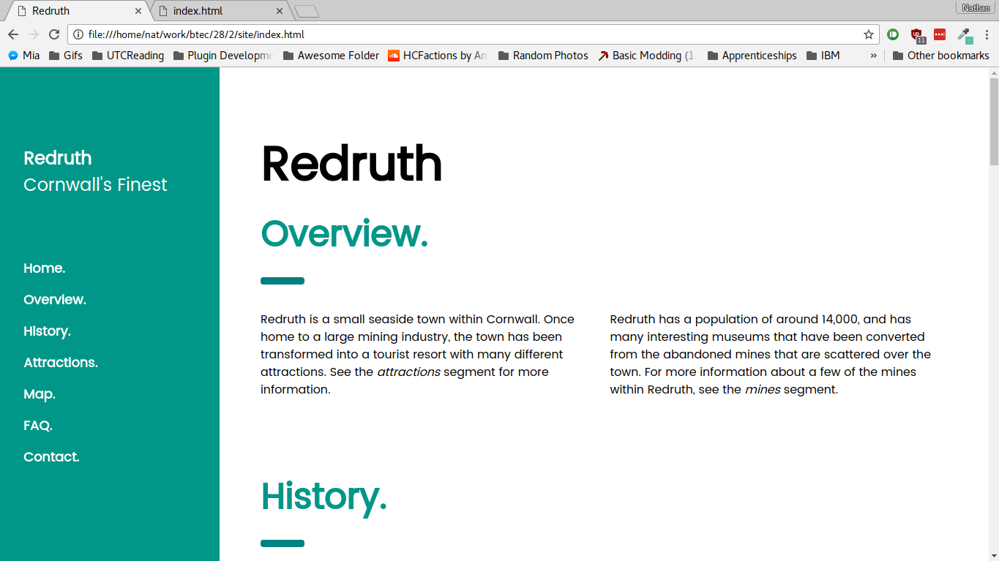

# Unit XXVIII Assignment II
*By Nathan Windisch*

## PIV: Designing an Interactive Website
For my website I shall be using two assets, as follows:

* W3.CSS - A Cascading Style Sheet library created by w3schools, a website based around teaching how to code, develop, use and understand computers along with learning markup languages such as HTML, Markdown and CSS.

* Redruth Map - A map by Ordinance Survey, a national map agency that covers all of Great Britain. It has been supplied Wikimedia, a free, open-source information website that allowed me access to the image. It is available for reuse as it is copyrighted under the Creative Commons licence, which allows for non-commercial redistribution.


## PV: Creating an Interactive Website
The website is made over one page, with a navigation bar on the side. 

### Header & Sidebar
The following code is from the header and sidebar.

```html
<!DOCTYPE html>
<html>
  <title>Redruth</title>
  <meta charset="UTF-8">
  <meta name="viewport" content="width=device-width, initial-scale=1">
  <link rel="stylesheet" href="https://www.w3schools.com/lib/w3.css">
  <link rel="stylesheet" href="https://www.w3schools.com/lib/w3-theme-teal.css">
  <link rel="stylesheet" href="https://fonts.googleapis.com/css?family=Poppins">
  <style>
    body,h1,h2,h3,h4,h5 {font-family: "Poppins", sans-serif}
    body {font-size:16px;}
    .w3-half img{margin-bottom:-6px;margin-top:16px;opacity:0.8;cursor:pointer}
    .w3-half img:hover{opacity:1}

    img {
        border: solid 5px transparent;
    }
    img:hover {
      border-color: teal;
    }
  </style>
  <body>
    <!-- Sidenav/menu -->
    <nav class="w3-sidenav w3-teal w3-collapse w3-top w3-large w3-padding" style="z-index:3;width:300px;font-weight:bold;" id="mySidenav"><br>
      <a href="javascript:void(0)" onclick="w3_close()" class="w3-padding-xlarge w3-hide-large w3-display-topleft w3-hover-white" style="width:100%;font-size:22px">Close Menu</a>
      <div class="w3-container">
	      <h3 class="w3-padding-64"><b>Redruth</b><br>Cornwall's Finest</h3>
      </div>
      <a href="#" onclick="w3_close()" class="w3-padding w3-hover-white">Home</a>
      <a href="#overview" onclick="w3_close()" class="w3-padding w3-hover-white">Overview</a>
      <a href="#history" onclick="w3_close()" class="w3-padding w3-hover-white">History</a>
      <a href="#attractions" onclick="w3_close()" class="w3-padding w3-hover-white">Attractions</a>
      <a href="#map" onclick="w3_close()" class="w3-padding w3-hover-white">Map</a>
      <a href="#faq" onclick="w3_close()" class="w3-padding w3-hover-white">FAQ</a>
    </nav>

    <!-- Top menu on small screens -->
    <header class="w3-container w3-top w3-hide-large w3-teal w3-xlarge w3-padding">
      <a href="javascript:void(0)" class="w3-button w3-teal w3-margin-right" onclick="w3_open()">☰</a>
      <span>Redruth</span>
    </header>

    <!-- Overlay effect when opening sidenav on small screens -->
    <div class="w3-overlay w3-hide-large" onclick="w3_close()" style="cursor:pointer" title="close side menu" id="myOverlay"></div>
```

And now here is what the header actually look like:


And here is what the sidebar actually looks like:


### Overview

## MII: Explaining the Tools and Techniques Used


## MIII: Improving the Effectiveness of the Website


## DII: Discussing Website Techniques that Aid a User


## DIII: Demonstrating that the Website meets the Requirements
