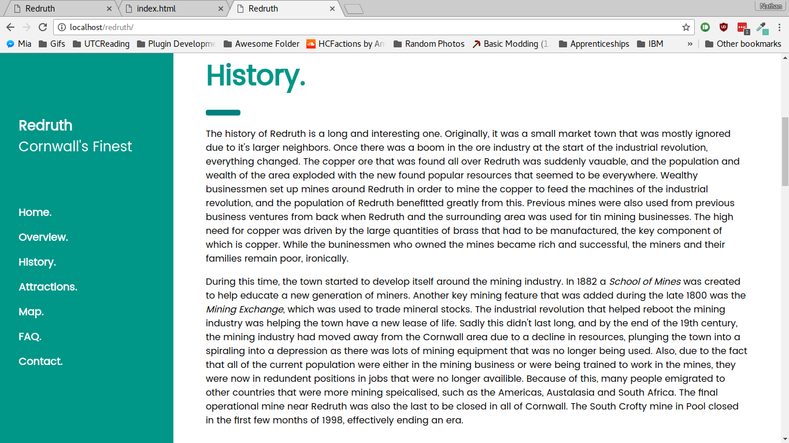
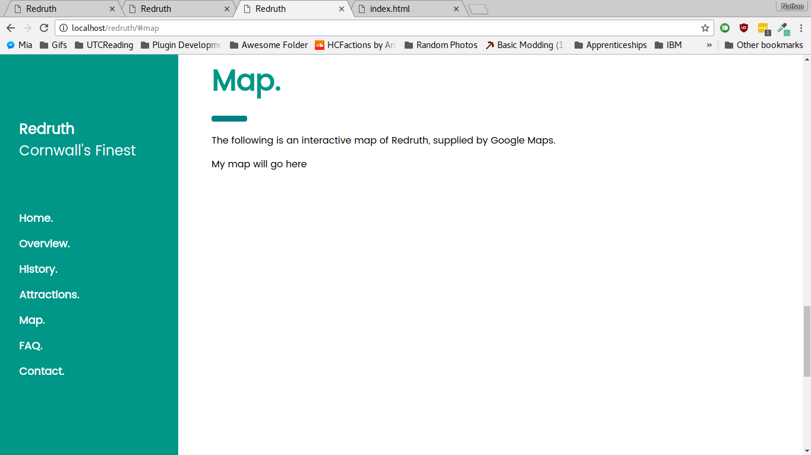
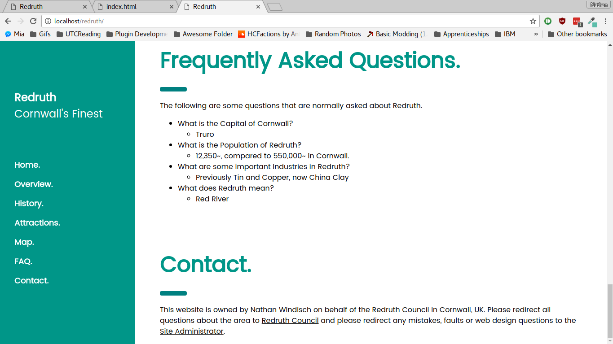
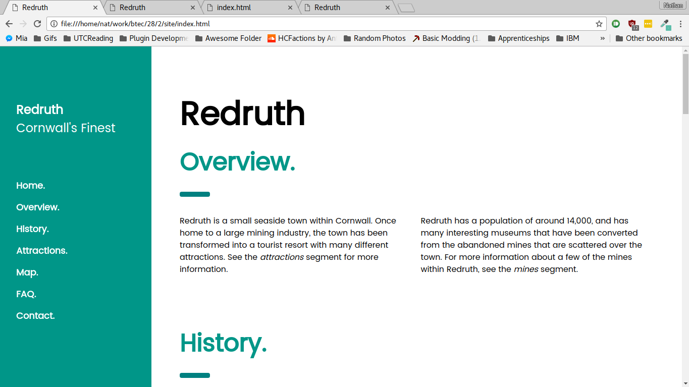

# Unit XXVIII Assignment II
*By Nathan Windisch*

## PIV: Designing an Interactive Website
### Moodboard & Storyboard
The following image is my storyboard for the website that can double up as a moodboard:
</img>

### Site Template & Colour Scheme
The following is my site template:

</img>

As you can see, the colour scheme that I am using is blue and teal. This is because it invokes a calm and peaceful emotional response from the reader, and makes them think of beaches, waves and relaxing times.

### Asset List
For my website I shall be using two assets, as follows:

* W3.CSS - A Cascading Style Sheet library created by w3schools, a website based around teaching how to code, develop, use and understand computers along with learning markup languages such as HTML, Markdown and CSS.

* Redruth Map - A map by Ordinance Survey, a national map agency that covers all of Great Britain. It has been supplied Wikimedia, a free, open-source information website that allowed me access to the image. It is available for reuse as it is copyrighted under the Creative Commons licence, which allows for non-commercial redistribution.

</img>

### Outline of Content
The following is a basic outline of the content that I am planning on having in my website:

* Header
* Sidebar
* Overview
* History
* Attractions
* Map
* Frequently Asked Questions
* Contact Us

<div style="page-break-after: always;"></div>

## PV: Creating an Interactive Website
The website is made over one page, with a navigation bar on the side.

### Header & Sidebar
The following code is from the Header and Sidebar.

```html
<!DOCTYPE html>
<html>
  <title>Redruth</title>
  <meta charset="UTF-8">
  <meta name="viewport" content="width=device-width, initial-scale=1">
  <link rel="stylesheet" href="https://www.w3schools.com/lib/w3.css">
  <link rel="stylesheet" href="https://www.w3schools.com/lib/w3-theme-teal.css">
  <link rel="stylesheet" href="https://fonts.googleapis.com/css?family=Poppins">
  <style>
    body,h1,h2,h3,h4,h5 {font-family: "Poppins", sans-serif}
    body {font-size:16px;}
    .w3-half img{margin-bottom:-6px;margin-top:16px;opacity:0.8;cursor:pointer}
    .w3-half img:hover{opacity:1}

    img {
        border: solid 5px transparent;
    }
    img:hover {
      border-color: teal;
    }
  </style>
  <body>
    <nav class="w3-sidenav w3-teal w3-collapse w3-top w3-large w3-padding" style="z-index:3;width:300px;font-weight:bold;" id="mySidenav"><br>
      <a href="javascript:void(0)" onclick="w3_close()" class="w3-padding-xlarge w3-hide-large w3-display-topleft w3-hover-white" style="width:100%;font-size:22px">Close Menu</a>
      <div class="w3-container">
	      <h3 class="w3-padding-64"><b>Redruth</b><br>Cornwall's Finest</h3>
      </div>
      <a href="#" onclick="w3_close()" class="w3-padding w3-hover-white">Home</a>
      <a href="#overview" onclick="w3_close()" class="w3-padding w3-hover-white">Overview</a>
      <a href="#history" onclick="w3_close()" class="w3-padding w3-hover-white">History</a>
      <a href="#attractions" onclick="w3_close()" class="w3-padding w3-hover-white">Attractions</a>
      <a href="#map" onclick="w3_close()" class="w3-padding w3-hover-white">Map</a>
      <a href="#faq" onclick="w3_close()" class="w3-padding w3-hover-white">FAQ</a>
    </nav>

    <header class="w3-container w3-top w3-hide-large w3-teal w3-xlarge w3-padding">
      <a href="javascript:void(0)" class="w3-button w3-teal w3-margin-right" onclick="w3_open()">☰</a>
      <span>Redruth</span>
    </header>

    <div class="w3-overlay w3-hide-large" onclick="w3_close()" style="cursor:pointer" title="close side menu" id="myOverlay"></div>


    <div class="w3-main" style="margin-left:340px;margin-right:40px">

      <div class="w3-container" style="margin-top:80px" id="overview">
        <h1 class="w3-jumbo"><b>Redruth</b></h1>
```

And now here is what the Header & Sidebar actually look like:


<div style="page-break-after: always;"></div>

### Overview
The following is the code for the Overview segment.

```html
	<h1 class="w3-xxxlarge w3-text-teal"><b>Overview.</b></h1>
        <hr style="width:50px;border:5px solid teal" class="w3-round">
      </div>

      <div class="w3-row-padding">
        <div class="w3-half">
          <p>Redruth is a small seaside town within Cornwall. Once home to a large mining industry, the town has been transformed into a tourist
    resort with many different attractions. See the <em>attractions</em> segment for more information.</p>
        </div>

        <div class="w3-half">
          <p>Redruth has a population of around 14,000, and has many interesting museums that have been converted from the abandoned mines that are
          scattered over the town. For more information about a few of the mines within Redruth, see the <em>mines</em> segment.</p>
        </div>
      </div>
```
This is the output of that code.


<div style="page-break-after: always;"></div>

### History
The following is the code for the History segment.
```html
<div class="w3-container" id="history" style="margin-top:75px">
      <h1 class="w3-xxxlarge w3-text-teal"><b>History.</b></h1>
      <hr style="width:50px;border:5px solid teal" class="w3-round">
      <p>The history of Redruth is a long and interesting one. Originally, it was a small market town that was mostly ignored due to it's larger
    neighbors. Once there was a boom in the ore industry at the start of the industrial revolution, everything changed. The copper ore that was found all over
    Redruth was suddenly vauable, and the population and wealth of the area exploded with the new found popular resources that seemed to be everywhere. Wealthy
    businessmen set up mines around Redruth in order to mine the copper to feed the machines of the industrial revolution, and the population of Redruth benefitted
    greatly from this. Previous mines were also used from previous business ventures from back when Redruth and the surrounding area was used for tin mining
    businesses. The high need for copper was driven by the large quantities of brass that had to be manufactured, the key component of which is copper. While the
    buninessmen who owned the mines became rich and successful, the miners and their families remain poor, ironically.
      </p>

      <p>During this time, the town started to develop itself around the mining industry. In 1882 a <em>School of Mines</em> was created to help
    educate a new generation of miners. Another key mining feature that was added during the late 1800 was the <em>Mining Exchange</em>, which was used to trade
    mineral stocks. The industrial revolution that helped reboot the mining industry was helping the town have a new lease of life. Sadly this didn't last long,
    and by the end of the 19th century, the mining industry had moved away from the Cornwall area due to a decline in resources, plunging the town into a
    spiraling into a depression as there was lots of mining equipment that was no longer being used. Also, due to the fact that all of the current population were
    either in the mining business or were being trained to work in the mines, they were now in redundent positions in jobs that were no longer availible. Because
    of this, many people emigrated to other countries that were more mining speicalised, such as the Americas, Austalasia and South Africa. The final operational
    mine near Redruth was also the last to be closed in all of Cornwall. The South Crofty mine in Pool closed in the first few months of 1998, effectively ending
    an era.
      </p>
</div>
```
This is the output.



<div style="page-break-after: always;"></div>

### Attractions:
This is what the Attraction's HTML is:
```html
<div class="w3-container" id="attractions" style="margin-top:75px">
      <h1 class="w3-xxxlarge w3-text-teal"><b>Attractions.</b></h1>
        <hr style="width:50px;border:5px solid teal" class="w3-round">
        <p>Oddles of fun.</p>
        <p>Cornwall has loads of fun things do to, and Redruth even moreso! Take a look at some of the things you can do below!</p>
      </div>

      <div class="w3-row-padding w3-grayscale">
        <div class="w3-col m6 w3-margin-bottom">
          <div class="w3-light-grey">
            <div class="w3-container">
              <h3>Mining.</h3>
              <p class="w3-opacity">Museums and Tours.</p>
              <p>As aforementioned, a large amount of Redruth's history is compromised of the large scale mining industry. Because of this, there are
    many fun and interesting abandoned mines that have been converted into museums and exhibitions. This means that you can learn more about the culture
    surrounding Redruth and the Cornish mining industry, including the impacts on the local area and the rest of the world.</p>
            </div>
          </div>
        </div>
        <div class="w3-col m6 w3-margin-bottom">
          <div class="w3-light-grey">
            <div class="w3-container">
              <h3>Crime Statistics.</h3>
              <p class="w3-opacity">Rest Easy.</p>
              <p>Redruth has a relatively low crime rate, as you can see in the graph below which depicts the crime statistics for 2016.
              </p>
              <p>
                Click the image for a higher resolution.
                <a href="chart.png">
                  
                </a>
              </p>
            </div>
          </div>
        </div>
      </div>

      <div class="w3-row-padding w3-grayscale">
        <div class="w3-col m6 w3-margin-bottom">
          <div class="w3-light-grey">
            <div class="w3-container">
              <h3>Education.</h3>
              <p class="w3-opacity">Learn About Learning.</p>
              <p>As aforementioned, a large amount of Redruth's history is compromised of the large scale mining industry. Because of this, there are
    many fun and interesting abandoned mines that have been converted into museums and exhibitions. This means that you can learn more about the culture
    surrounding Redruth and the Cornish mining industry, including the impacts on the local area and the rest of the world.</p>
	      <hr style="height: 0pt; visibility: hidden;" />
            </div>
          </div>
        </div>
        <div class="w3-col m6 w3-margin-bottom">
	  <div class="w3-light-grey">
	    <div class="w3-container">
    	 <h3>Beaches.</h3>
    	      <p class="w3-opacity">Relaxing Times.</p>
	      <p>Redruth has three incredible beaches with loads of things to do. All of these beaches have good surf and seasonal lifeguard support.</p>
	      <p>
	      	<ul>
		  <li>
	  	    Porthtowan is a Blue Flag beach.
		  </li>
		  <li>
	  	    Chapel Porth Beach has excellent parking.
		  </li>
		  <li>
		    Portreath Beach has a Café with great food, along with some clean toilets and great parking.
		  </li>
      		</ul>
	      <hr style="height: 4pt; visibility: hidden;" />
    	      </p>
  	    </div>
	  </div>
	</div>
      </div>
```
This is the output:


### Map
This is what the Map's HTML is:
```html
<div class="w3-container" id="map" style="margin-top:75px">
        <h1 class="w3-xxxlarge w3-text-teal"><b>Map.</b></h1>
        <hr style="width:50px;border:5px solid teal" class="w3-round">
        <p>The following is an interactive map of Redruth, supplied by Google Maps.</p>
      </div>

      <div class="w3-row-padding">
        <div class="w3-half w3-margin-bottom">
	  <div id="mapdiv" style="width: 400px; height: 400px;">My map will go here</div>
	  <script>
	    function myMap() {
    	      var mapOptions = {
	        center: new google.maps.LatLng(50.233107, -5.227353),
        	zoom: 15,
        	mapTypeId: google.maps.MapTypeId.HYBRID
    	      }
	      var map = new google.maps.Map(document.getElementById("mapdiv"), mapOptions);
	    }
	  </script>
	  <script src="https://maps.googleapis.com/maps/api/js?callback=myMap"></script>
        </div>
      </div>
```
And this is the output document:



As you can see, the map is broken currently.

<div style="page-break-after: always;"></div>

### Frequently Asked Questions
The following is the code for the Frequently Asked Questions:

```html
      <div class="w3-container" id="faq" style="margin-top:75px">
        <h1 class="w3-xxxlarge w3-text-teal"><b>Frequently Asked Questions.</b></h1>
        <hr style="width:50px;border:5px solid teal" class="w3-round" />
        <p>The following are some questions that are normally asked about Redruth.</p>
	        <p>
	  <ul>
	    <li>What is the Capital of Cornwall?
	      <ul>
	        <li>Truro</li>
	      </ul>
	    </li>
	    <li>What is the Population of Redruth?
	      <ul>
	        <li>12,350~, compared to 550,000~ in Cornwall.</li>
	      </ul>
	    </li>
	    <li>What are some important Industries in Redruth?
	      <ul>
	        <li>Previously Tin and Copper, now China Clay</li>
	      </ul>
	    </li>
	    <li>What does Redruth mean?
	      <ul>
	        <li>Red River</li>
	      </ul>
	    </li>
	  </ul>
	</p>
      </div>
    </div>
```

And the following is the output:


<div style="page-break-after: always;"></div>

### Contact Us
The following is the code for the Contact Us page:

```html
      <div class="w3-container" id="contact" style="margin-top:75px">
        <h1 class="w3-xxxlarge w3-text-teal"><b>Contact.</b></h1>
        <hr style="width:50px;border:5px solid teal" class="w3-round" />
	<p>This website is owned by Nathan Windisch on behalf of the Redruth Council in Cornwall, UK. Please redirect all questions about the area to <a href="mailto:admin@redruth-tc.gov.uk">Redruth Council</a> and please redirect any mistakes, faults or web design questions to the <a href="mailto:nathan@windisch.co.uk">Site Administrator</a>.</p>
      </div>
    </div>
```

<div style="page-break-after: always;"></div>

## MII: Explaining the Tools and Techniques Used
One tool that can be used to create websites are WYSIWYG based editors such as Serif Web Plus, which is a premium software that you have to download. Serif Web Plus allows users to drag and drop elements onto their website and make them interact with one another. I personally find this software difficult and "fiddly", as you need to do many things to change a functional website into a good looking one. I would recommend this for beginners as you can build a website visually and then view the HTML and learn from it. Another WYSIWYG editor is Wix, an online website builder that is similar to Serif Web Plus but is more proprietary and does not give the user access to the HTML. Also, it being online it is Software As A Service or SaaS, meaning that you need a constant internet connection to access it.

One technique that must be used when writing a website is a markup language. A popular example of this is `HTML`, and derivatives of this such as `XHTML` and `HTML5`. These languages allow users to populate webpages with text, images, link, tables and more. HTML can be difficult to use due to it's extensive amount of variables that need to be learnt and placed in the right order for the webpage to function as intended, meaning that a user may prefer another markup language. A popular one is called `BBCode` and it is primarily used in forum software for easier embedding of links and images. Another language is `Markdown`, which is widely used by developers to generate good documentation such as `README.md` pages. Markdown is also used on some social media websites such as `reddit`, which lets users format text. The reason why `Markdown` and `BBCode` are used on forum software and social media is because it gives users similar experience to the formatting of HTML, without the possible security flaws involved.

Another technology that can be used in conjuncture with HTML documents are Cascading Style Sheets, or `CSS`. CSS allows developers to customize the output of the HTML, from simply changing colours to 3D design, beautiful menus and even calculators, when combined with some JS.

One final technology is server side scripting. This can allow users to interact with a website in many different ways, such as registering for a website, smooth scrolling, code syntax correction and even online graphic novels! There are two main languages that are used in server side scripting, the first being `PHP`, or PHP: Hypertext Preprocessor - a recursive acronym. This software is purely run on the server side, meaning that the client does not need to download or install any external libraries in order to use the website. The other software is called JavaScript, or more commonly known as `JS`. JS is the client-side variation of the code, but it can be run on a server as `Node.JS`.

<div style="page-break-after: always;"></div>

## MIII: Improving the Effectiveness of the Website
There were two main improvements that needed to be performed to the website to make set it to a publishable state, the first being to fix the map. The main issue with this was that the webpage was hosted on a local server which did not have JavaScript installed, whereas if I viewed the code as a file the JavaScript would work. The following is an image of the working version of the website with the map working:


The other improvement was that I should add some copyright text to the bottom of the website to prevent theft of my data. The following was the code for this copyright text:

```html
<div class="w3-container" id="contact" style="margin-top:75px">
  <h1 class="w3-xxxlarge w3-text-teal"><b>Contact.</b></h1>
  <hr style="width:50px;border:5px solid teal" class="w3-round" />
  <p>This website is owned by Nathan Windisch on behalf of the Redruth Council in Cornwall, UK. Please redirect all questions about the area to <a href="mailto:admin@redruth-tc.gov.uk">Redruth Council</a> and please redirect any mistakes, faults or web design questions to the <a href="mailto:nathan@windisch.co.uk">Site Administrator</a>.</p>
</div>
```

And the following is the code for the updated navbar

```html
      <a href="#" onclick="w3_close()" class="w3-padding w3-hover-white">Home.</a>
      <a href="#overview" onclick="w3_close()" class="w3-padding w3-hover-white">Overview.</a>
      <a href="#history" onclick="w3_close()" class="w3-padding w3-hover-white">History.</a>
      <a href="#attractions" onclick="w3_close()" class="w3-padding w3-hover-white">Attractions.</a>
      <a href="#map" onclick="w3_close()" class="w3-padding w3-hover-white">Map.</a>
      <a href="#faq" onclick="w3_close()" class="w3-padding w3-hover-white">FAQ.</a>
      <a href="#contact" onclick="w3_close()" class="w3-padding w3-hover-white">Contact.</a>
```

This is the Contact text:



And this is the updated navbar:



<div style="page-break-after: always;"></div>

## DII: Discussing Website Techniques that Aid a User
There are a few things that can be used within a website to aid a user's navigational journey through a website. The first of which is page tagging. This means setting the metadata of a webpage to contain specific data allowing for easier categorisation of similar pages. This means that if a user goes to `https://example.org/tag/code` then they will have access to view all the pages tagged with "code". The issue with this is that many different subjects can be grouped under "code", such as `C#`, `Java` and `Ruby`. Along with this, markup languages which are not strictly programming languages could be categorised here, such as `HTML` and `Markdown`. To subcategorise this, the tag `/code/programming` could be implemented to ensure that only the latter list of searches will come up. If the user wanted to be even more specific, they could use `/code/js` to access only JavaScript resources. The only real downside to this is that the feature will take a lot of time and effort as many different tags will need to be added to each page in order to make this system complete. This large amount of effort may also be wasted, depending on how many people actually use this system.

Searching is a key part of website traversal. It allows the user to enter key terms and get results of those terms, ranked from many different variables such as most searched, most relevant, or alphabetical. This algorithm can be tweaked and modified behind the scenes for optimization purposes, without generally affecting the user's experience. The main issue with this technology, in comparison to showing the user a word mp of all the tags used, with larger ones either having more pages or searched more often, is that it can take a lot of time and energy to get right. If the code to execute a search is written poorly, then users may leave the site as they find it difficult to find things. Because of this, website developers should try to implement as many technologies as possible in order to allow the user to pick and chose how they want to navigate the site. This means that algorithms from other sites may need to be taken and adapted, but developers must ensure that these algorithms have open source licences such as `MIT` or `Creative Commons`.

Sitemaps are another valid for of transportation between webpages within websites. A sitemap is a list of all webpages within a site, and how they are hierarchically ordered. For instance, all pages on a site are children of the `index` page, but only the `attractions` page has the children: `mining`, `education`, `crimestats` and `beaches`. If the website that I made was made up of multiple pages rather than a single page, then this is how it would be laid out. It allows users to have a large overview of all pages on the system, meaning that they will never lose a page again as they will all be stored there as a glossary, with brief descriptions next to each entry.

Menus are a highly important part of navigating a website, as they give the user a quick and easy interface in which they can interact to change the current page that they are on. Menus should be reactive so that the user knows if they are hovering over an object. It should also show if the link has been visited. Both of these can be done by CSS, as shown below.

```css
/* An unvisited link. */
a:link {
  color: white;
}

/* A visited link. */
a:visited {
  color: cyan;
}

/* A link that is being hovered on */
a:hover {
  color: red;
}
```

Menus should also highlight the current place in which a user is in, so that they know where they are in position to other links. The following is an example screenshot from my personal website, https://natfan.github.io/


The reason why THINGDEX is emboldened is because all things that are not either the home page, the about page or the contact page are placed under the Thingdex in alphabetical order.

## DIII: Demonstrating that the Website meets the Requirements
The end goal of this website was to try to attract new people to a place in the UK. The website had to contain 5 pages about various things to do with the place, and the theme of the website had to match the region. I achieved this by making a website that is comprised of 7 subsections on one page, 2 of which are miscellaneous links: one that goes to the top of the page and the other that takes the user to the bottom of the page where they can see contact information and copyright data. The other 5 sections are as follows:

* Overview
 - This was a page that was giving a general overview of the town, including quick statistics and suggestions on which parts of the site to visit if they want to learn more.
* History
 - This was a rather in-depth section that explained how Redruth came to be, from it's origins to the end of the mining era that was a huge landmark in the change of the small, old mining town.
* Attractions
 - This page describes four main attractions about Redruth
  * Mining
  * Education
  * Low Crime Levels
  * Beaches
* Map
 - This page gives the user access to an interactive map, powered by Google Maps.
* FAQ
 - This page has some short quick questions about Redruth, and their answers.

These 5 segments contains lots of data that a person can use to make a decision to move to Redruth.

I believe that the colour scheme that I chose for this website is good as it is a similar colour to the ocean and makes the user think about calm things, influencing their decision to move to Redruth.
