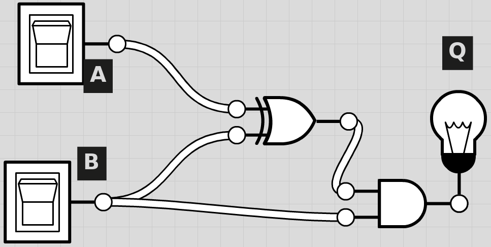

# COMP2 2013 Answers
*Nathan Windisch*

Question 1)

    1. 4th
    2. 1st

Question 2)

    1.  i. Program Counter
        ii. ???

    2.  i. Load address to Program Counter
        ii. Load Program Counter to Memory Address Register
        iii. Decode Current Instruction Register

Question 3)

    1.  i. USB Sticks
        ii. USB Sticks are useful for quickly transferring files as they are small and do not require power as there are no moving parts.

    2.  i. Hard Drives
        ii. Hard Drives are better than Magnetic Tapes as MT require lots more equipment than a HDD. Also HDDs are more reliable.

    3.  i. DVD-R
        ii. DVD-R is good for transferring data as it allows software distributors to make them read only after finishing, meaning that they cannot be tampered with during transit.

Question 4)

    1. A protocol is a set of rules governing the exchange of data between devices.

    2. A high level language interpreter interprets the code that is written into machine code, which is then translated into machine code for the processor to read and execute.

    3. Stored program is when a program that has been compiled needs to be executed again without being changed, instead of the program being recompiled the data is taken from the hard drive and is just executed under new parameters, effectively saving time by not having to compile the source each time.

    4. LOAD 21 //loads 21 (lmotor)
       STORE 21 23 //stores lmotor in temp
       ADD 21 -21 //sets lmotor to 0
       ADD 21 22 //sets lmotor to rmotor
       ADD 22 23 //sets rmotor to temp (lmotor prev speed)

    5. i. The robot has to check if the balls colour is X, and if it is not then check if it is Y and so on
       ii. The robot has to store each colour as a variable then load it again when called
       iii. A child's brain is different to a processor as information is stored in multiple areas for maximum effectiveness.

    6. i. A digital camera saves the image taken in an RBG format, meaning that each pixel is a 6 character code ranging from A-F, 0-9. This means that the image that was taken can be viewed by anything with the correct drivers installed.

      ii. Students may only use the lower resolution as the files may then have a smaller file size, meaning that more can be stored.

Question 5)

    1. Do we have to do this question? I was under the impression that we no longer had to do HTML and website creation.

Question 6)

    1. i. AND
       ii. NAND
       iii. OR
    2. i. B . (A+!A) = B . (A+A) = B . A = A
       ii. A . B + B = A . B = A
       iii. !B . !(!A+!B) = !B . (A+B) = A . (B+!B) = A . B = A

Question 7)

    1. Data Protection Act
    2. The data is not protected as any user that has access to the main system can access all subsystems.
    3. If a user that is logged in can access other people's data, then it means that if that user's network is compromised then all of the other data could be breached.
    4. i. HTTP is not encrypted, meaning that the data could be breached if the network is compromised.
       ii. HTTPS is better as it is securely encrypted when sent, along with when received.
    5. i. Utility Program
       ii. Bespoke Application Software
       iii. Special Purpose Application Software

Question 8)

    1. Again, do we have to do this question? HTML is redundant, no?