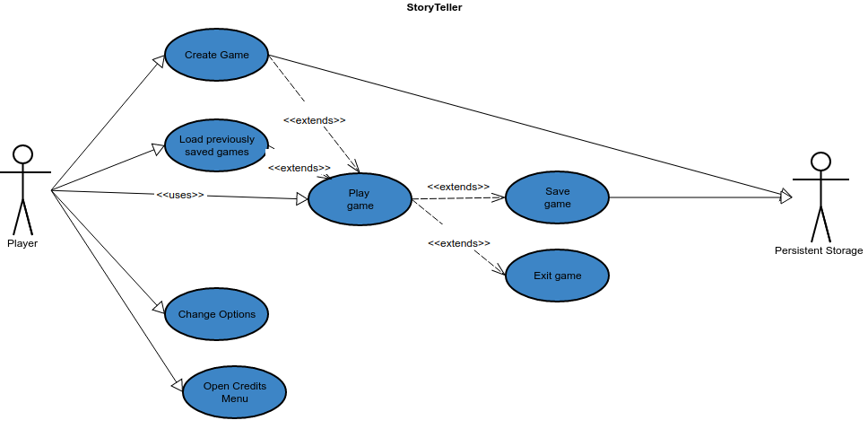
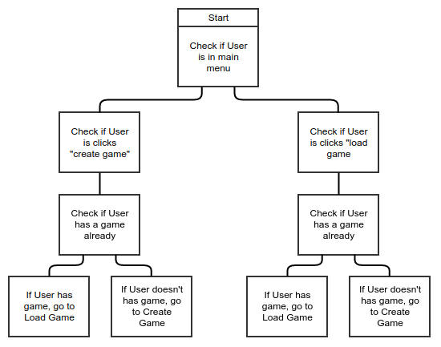
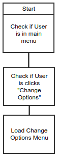
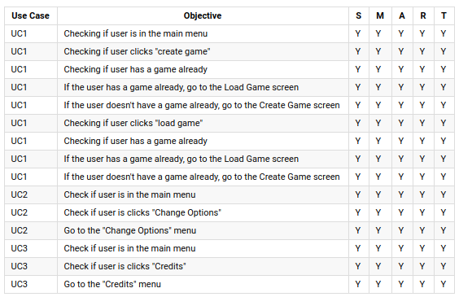
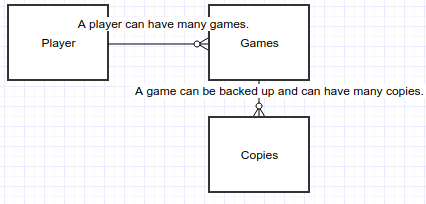
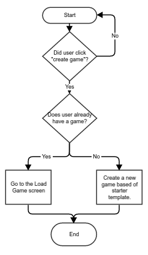
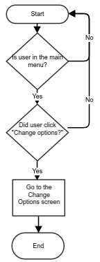
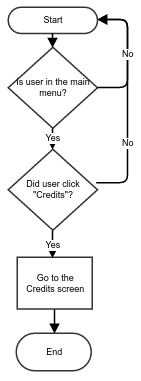
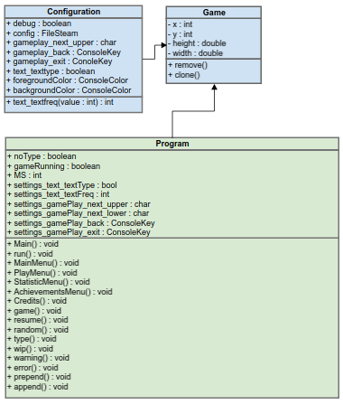
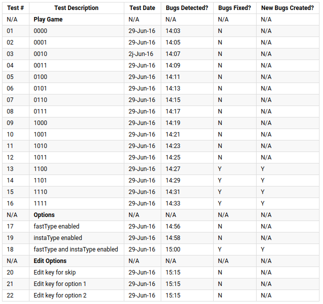

# Computer Science Project
*By Nathan Windisch*

<div style="page-break-after: always;"></div>

## Introduction
### Scope
The issue is that there are not many choose-your-adventure video games on the market right now. My client is Oliver Eastgreen Cox and he has requested that I work with him to develop an application which will enable the user to play through predetermined stories, along with an audiobook being played alongside, for those with headphones who prefer listening to reading. The proposed final product, which I shall not be developing in this project but will be worked on later if further expansion is required, will have multiple free stories for the user to choose from, all with different themes and lengths in order to satisfy everyone's fictional tastes, from Science Fiction to Fantasy to Horror. All stories are intended to have multiple endings, but only a few of them may be able to be completed for this demonstration. Expansion packs could be made later down the line, to generate more profit. These expansion packs could be more stories categorised under different genres, changes to the colour scheme of the user interface or general soft currency which could be used to purchase these features or more that we add in the future. Another idea that has been toyed with is the ability for players to gain achievements while playing which, in turn will give them the soft currency for free, meaning that users can gain access to the paid content without spending any money at all, it will just be significantly harder as they will not earn as much as those that pay. As the game is single player, balance is not an issue at all due to the fact that nothing that a player does will have any significance to any other player at all. A player can cheat through the entire game and it will have no consequence to the rest of the playerbase.

To recap, the project will have the following features:

* A basic story with two or three different outcomes
* Items that are required to perform various actions within the story
* A menu which allows the user to select stories that they have selected
* A UI which is easy to use
* An options page
* A credits page

This is the full scope of the project that I shall be undertaking.

<div style="page-break-after: always;"></div>

### Boundaries
The general planned boundaries for my project, that being the inputs and outputs of the program, are as follows:
**Inputs**
* Users can create their games from a template.
* Users can save their games.
* Users can access their game later via the saved files.
* Users can perform different actions to change how the story develops.
* Users can change the options.
* Users can view the credits.
*Please note that all of these are input actions that the user can perform.*

**Outputs**
* Program will generate a new game from a template when the user creates a game.
* Program will write their game to a file using XML as a configuration service.
* Program will read their XML save file when loading a game.
* Program will go to different parts of the story based on what actions the user performs.
* Program will update the configuration file and reload it when options changes are saved.
* Program will access and display the credits page on demand.

<div style="page-break-after: always;"></div>

### Convincing The Client
When discussing with the client for the first time we had a talk about what we wanted to create. He wanted an Android and possible an iOS application, but I explained to him that the development of two applications was too tricky. He listed the things that he wanted from the product, which I mentioned beforehand. After noting down what he wanted from me, I set to work on creating my very first Android application. After vigorous testing, I decided that it would be easier if I made a C# console variant of the game, and then ported it over to Android (and therefore Java, which is every similar language) later, once it was finished. He accepted my decision after I explained that it wouldn't take too long to convert over to Android. I had successfully convinced the client.

<div style="page-break-after: always;"></div>

### Complexity
The complexity of the project is that I shall start to work with C# to create a Console Application, then I shall port it over to Android during my second round of development. I shall attempt to add in XML, configuration, multiple classes, functions and I may look at implementing PHP and HTML in order to generate a leaderboard that users can view when not on the game, so that they can view it when not at their computers.

<div style="page-break-after: always;"></div>

## Analysis
### Outline
I have decided to approach the project by listing all the features that the client needs to have completed for a base product, what could be added to the project within the timescale and what may be added if there was a larger timespan on which to develop this program to it's full potential, if there were more time and resources available to me and my client. Some of the tasks that the client would like me to complete are:

* UI configuration
* Viewing stories grouped by genre
* Viewing stories grouped by last read
* Viewing stories grouped by user rating

The following are some tasks which would be possible if a second round of development were to be initiated, or if a longer timespan with more resources were to be used instead:

* Audio playing along with the user reader reading the story
* Access to a store page where users can purchase expansion packs and other downloadable content
* Ability to unlock and view achievements
* Ability to sign up to a web service in order to save and load progress, along with achievements and configuration profiles
* Ability to view leaderboards to see who has completed stories in the shortest amounts of time, with the most gear unlocked, who gained the most achievements and more

<div style="page-break-after: always;"></div>

### Use Case Diagram
The following is a UML 2.0 diagram that I have created to show how the proposed system will work.

</img>

As you can see, the Player has a few different options that they can choose from, such as:

* Creating the game
* Loading previously saved games
* Playing the game, which both creating and loading the game inherently extends their functionality towards
* Changing options
* Viewing the credits menu

Once they create the game, the game is instantly written to disc, meaning that it is persistent. When the user enters the game, they can view a menu which gives them two options:

* Saving the game
* Exiting the game

It is important to note that if you wish to quit and save your progress you will need to save then quit, or the game will just exit without writing your progress to the configuration files.

<div style="page-break-after: always;"></div>

### IOPS Chart
When working with my Use Case UML diagram, I discovered that there were a few IOPS procedures that needed to be looked at before I could continue. For reference, IOPS stands for `Input, Output, Processing and Storage`.

The first IOPS issue that I came across was the fact that I was not fully sure how I would allow the user to generate the default game files so that the user can create the game for the first time. I developed the following chart to make it clearer for myself when I got round to developing the actual program.

</img>

This is an IOPS chart that shows how a game is created. It contains redundancies to allow the user to enter the Load Game screen but still create a fresh game save if they have none currently.

The second IOPS issue that I came across is that I do not have a visual representation as to how the Change Options and Credits Menu functions will work. The following is a quick IOPS chart as to how the Change Options menu shall function:

</img>

The following IOPS chart is how the Credits menu will function:

</img>

<div style="page-break-after: always;"></div>

### SMART Objectives
After identifying my Use Case issues via IOPS, I decided to create a SMART Objectives table to list all the sub issues that I have and if they fall under the SMART categories or not. SMART stands for `Specfic`, `Measureable`, `Achieveable`, `Realistic` and `Time Bound`.

</img>

These are all of my SMART objectives for my three issues that I found with my Use Case Diagrams and IOPS Charts.

<div style="page-break-after: always;"></div>

### Interview
After generating all of this data I met up with my client for my first interview. The following is a rundown of what was discussed. The prefix `(O)` is for things that my client, Oliver Cox said, and the prefix `(N)` is for things that I said.

(O): So I asked you to test if the design for the system that I sent you would work. What were your findings?

(N): After lots of testing, I found that all of the things that I drew up in this Use Case Diagram would work in theory, but I had to expand each point so that I knew what to do.

*I then showed him the Use Case Diagram, which was the initial design, and the IOPS chart, which was the follow up points.*

(O): These are all very good, was there anything else that you found out during your analysis?

(N): Yes, there was. After working on my IOPS chart, I decided to create a list of SMART objectives to see if the Use Cases were Specific, Measurable, Achievable, Realistic and Time Bound.

(O): Cool, what were your findings?

(N): As you can see... *I showed him the SMART Objectives table.* All of the points within the Use Case Diagram are all Specific, Measurable, Achievable, Realistic and Time Bound.

(O): Very good, it seems as if you have been making progress. Let's have another meeting when you have more to show me.

### Feedback
I didn't get as much feedback as I would have liked from my interview with my client. I would have preferred more clearly defined tasks set up during the interview. Sadly the tasks that Oliver requested of me were more general and less specific. Luckily, I was able to relay what I had done to my client, so that he was kept on top of what I have been doing. This was the first meeting with feedback that I gained from my client.

<div style="page-break-after: always;"></div>

## Design
### Testing Strategy
My testing strategy can be seen below and I shall test all of the routes that my current game mock up can do and as there are a total of 4 decisions with two independent choices, I shall be using four bit binary to make a plan, where 0 is the first decision and 1 is the second. I shall then perform all these tests one after the other, and see which do not work.

Another part of my testing strategy will be testing the options menu, and if different options work with one another. The final part of the strategy will be testing if I can edit keybinds from the options menu.

<div style="page-break-after: always;"></div>

### Test Plan
The following are my test cases. Please note that the numbers under **Play Game** are due to the fact that I have a total of four tests currently set up, and each one can be dependent on any other. This means that there is a total of 16 possible tests, and I performed them all. The **Options** subsection is when I tested a quick mock up of the application, and the results can be seen in the table below.

</img>

<div style="page-break-after: always;"></div>

### Entity Relationship Diagram
There are not many parts of my program that will require an Entity Relationship Diagram, but a part that will require it is the game saving part of my code. The following is my Entity Relationship diagram for that segment:

</img>

<div style="page-break-after: always;"></div>

### Human Computer Interaction
Human Computer Interaction is the way that Humans interacts with computer systems and programs. Human Computer Interaction is highly important as without it, users would not be able to use the software very well, if at all. Human Computer Interaction can be made possible via making easy to use instructions and documentation, meaning that users can use the software without having to go through the source code and understanding what was actually programmed. A successful point of Human Computer Interaction is a well built interface that looks like it was designed by a human rather than a computer, meaning that people will be able to use it easier.

<div style="page-break-after: always;"></div>

### Flow Chart
I have decided to make a flow chart for each Use Case that I have developed in previous segments. The first Use Case, UC1, can be seen developed into a flow chart below.

</img>

The following is the flow chart for UC2.

</img>

The following is the flow chart for UC3.

</img>

<div style="page-break-after: always;"></div>

### Class Diagram
The following is my class diagram for my project:

</img>

<div style="page-break-after: always;"></div>

## Implementation
For the fully annotated code, please see Appendix A.

<div style="page-break-after: always;"></div>

## Testing
The following are my test cases for the code itself. As I had already mocked up a prototype beforehand, the results are similar to the test cases before.

</img>

<div style="page-break-after: always;"></div>

## Evaluation
### User Acceptance Tests
User Acceptance Tests are a highly important part of the Evaluation process. User Acceptance Tests are tests which involve asking the user questions about the system and seeing if the user finds the system well built, easy to use and enjoyable to use. Sadly I had no users available to test, but I did have my client who could help me test the program. He said that the features were good and well implemented but it felt too basic for a final product. I agree with this statement, and I shall work on this the next time I work on developing new features for the program. I reminded him that this was just a prototype and that the final version would be greatly improved.

### Interview Feedback
My interview feedback can be considered similar to the User Acceptance Tests, as they were conducted by the same person. This means that all feedback given to me via the user should also be considered part of the feedback from the interview that we had, but with some more additional points:

* He would prefer it if the features that we discussed at the start of the project would be implemented, such as leaderboards, achievements and downloadable content.
* He would also prefer it if the product was written for Android applications, which is something I will do in my second round of development later on.
* He liked the simplistic UI style with the old-school character by character typing system, as he felt it made the game nostalgic and self-aware of the games that it was built on.

<div style="page-break-after: always;"></div>

### Future Extensions
One future extension that I can add to the program is the ability for users to log into a server, in order to save your progress. Along with this feature, it means that leaderboards and profiles can be generated off that data. It also entails that users will be able to access their data across different devices. An impact of this is that it may cost lots of money to host these servers, as they will require lots of data due to the sending and receiving user's data, which could range from mere bytes to megabytes, depending on how much of the game they have completed, the amount of books they have open and the amount of achievements they have completed, unlocked or in progress. All of this data will also take up space on the server, possibly meaning that multiple hard disk drives will be required if the game's user base gets very large very fast. Hopefully this will mean that, while it may cost a lot of money to keep the game running, we will gain more money in profit, from the users that are purchasing in game products.

Another future implication is that the game will need to be updated regularly. This means that I will need to implement an update system that does not get blocked by firewalls and cannot get compromised, meaning that the game cannot get hacked and malicious software cannot get installed.

<div style="page-break-after: always;"></div>

## Appendix
### A: The Code
The following is my code for the game StoryTeller.

```c#
using System;
using System.Collections.Generic;
using System.Linq;
using System.Text;
using System.Threading.Tasks;
using System.IO;
using System.Configuration;


namespace StoryTellerTextBasedAdventureGame {
    // this is where the configuration settings are generated in a flatfile.
    public class Config {
        public static bool debug = true;

        public static FileStream Q = new FileStream("config.txt", FileMode.OpenOrCreate, FileAccess.Write);
        // because of this line, sadly it will only work on machines with the correct file path, relative paths will be used in the next developement run to allow a wider access to the game.
        public static char gamePlay_next_upper = ConfigurationSettings.AppSettings.Get(
            #region URL
            "C://Users/natha_000/Documents/Visual Studio 2015/Projects/StoryTellerTextBasedAdventureGame/StoryTellerTextBasedAdventureGame/" +
            #endregion
            "App.config/config/gamePlay/next_upper").ToCharArray()[1];
        //public static char gamePlay_next_upper = 'C';
        public static ConsoleKey gamePlay_back = ConsoleKey.Backspace;
        public static ConsoleKey gamePlay_exit = ConsoleKey.Escape;
        public static bool text_textType = true;
        public static int text_textFreq(int value) {
            //int text_textFreq = 0; // DEBUG, COMMENT OUT IF NEEDED.
            int text_textFreq = 45000; //LIVE, COMMENT OUT IF NEEDED.

            value = text_textFreq;

            return value;
        }
        public static ConsoleColor foregroundColor = ConsoleColor.Gray;
        public static ConsoleColor backgroundColor = ConsoleColor.Black;
    }

    // this is where the actual code is run
    class Program {
        // this is where all of the variables for the game are stored
        static bool noType = false;
        static bool gameRunning = false;
        List<string> inventory = new List<string>();

        // this is where the constants that mustnt be changed are stored
        #region Constants
        const int ms = 1000;
        #endregion

        // this is where the settings are set up
        #region Settings
        bool settings_text_textType = Config.text_textType;
        static int settings_text_textFreq = Config.text_textFreq / ms; // In Seconds

        static char settings_gamePlay_next_upper = Config.gamePlay_next_upper;
        char settings_gamePlay_next_lower = char.ToLower(settings_gamePlay_next_upper);

        static ConsoleKey settings_gamePlay_back = Config.gamePlay_back;

        static ConsoleKey settings_gamePlay_exit = Config.gamePlay_exit;
        #endregion

        // this is where all the commonly used strings are called
        #region Strings
        #region GameText
        string gameText_next = "\n\nPress " + settings_gamePlay_next_upper + " to continue. ";
        string gameText_back = "\nPress " + settings_gamePlay_back + " to go back. ";
        string gameText_exit = "\nPress " + settings_gamePlay_exit + " to quit.";
        #region ImportantWords
        static string gameText_importantWords_game = "StoryTeller";
        static string gameText_importantWords_gameTitle = gameText_importantWords_game + " - The Virtual Gamebook";
        #endregion

        #region Welcome
        string gameText_welcomeText_Welcome = "Hello, and welcome to StoryTeller.\nIn this game, you make the decisions and the story builds around your actions. \nWhen prompted, type where you want to go or what you want to do. \nYou shall be prompted with what options you can do. \n\nThe following is an example: \nYou enter a room. You can go 'F'(ORWARDS), 'B'(ACKWARDS), 'L'(EFT), 'R'(IGHT). \nYour choice must match the options given, but does not have to be case sensitive. \nDo not attempt to complete the example; nothing will happen.";
        #endregion

        #region Menu
        string gameText_menuText_Main = "Main Menu \n1) Play \n2) Statistics \n3) Achievements \n4) Credits ";
        string gameText_menuText_Play = "Play \nOh, hi there " + Environment.UserName + ". Pick an option, please.\n1) Start A New Game ";
        string gameText_menuText_Stats = "Statistics";
        string gameText_menuText_Achievements = "Achievements";
        string gameText_menuText_Credits = "Credits \n" + credits_title_leadDeveloper + ": " + credits_name_nathanWindisch + "\n" + credits_title_writer + ": " + credits_name_oliEastGreenCox + "\n" + credits_title_writer + ": " + credits_name_nathanWindisch + "\n" + credits_title_tester + ": " + credits_name_jamesCox + " " + credits_notes_norelation;
        #region Play Menu
        string gameMenu_menuText_playMenu_resumeGame = "\n2) Resume Previous Game";
        #endregion
        #endregion

        #region StoryText
        #endregion

        #region Credits
        #region Titles
        static string credits_title_leadDeveloper = "Lead Developer";
        static string credits_title_writer = "Writer";
        static string credits_title_tester = "Tester";
        #endregion

        #region People
        static string credits_name_nathanWindisch = "Nathan Windisch";
        static string credits_name_oliEastGreenCox = "Oli Eastgreen Cox";
        static string credits_name_jamesCox = "James Cox";
        #endregion

        #region Notes
        static string credits_notes_norelation = "(No relation)";
        #endregion

        #endregion

        #endregion

        #endregion

        // this is the Main code that is executed on run. it calls the "run()" code as a new instance, so as not to get confused, it is never called
        static void Main(string[] args) {
            Console.Clear();
            new Program().run();
        }

        // this is where all the code starts, it is called with
        // run();
        void run() {
            Console.Title = gameText_importantWords_gameTitle;
            Console.SetWindowSize(100, Console.WindowHeight);
            Console.ForegroundColor = Config.foregroundColor;
            Console.BackgroundColor = Config.backgroundColor;
            inventory.Clear();

            while (!Console.KeyAvailable) {
                Console.Clear();
                //Console.WriteLine(random(0, 5));
                type(gameText_welcomeText_Welcome);
                type(gameText_next);
                noType = false;

                ConsoleKeyInfo next = Console.ReadKey();
                if (next.KeyChar == settings_gamePlay_next_lower || next.KeyChar == settings_gamePlay_next_upper) {
                    Console.Clear();
                    MainMenu();
                } if (next.Key == ConsoleKey.Escape) {
                    Environment.Exit(0);
                } else {
                    Console.Clear();
                    run();
                }
                Console.ReadLine();
            }
            Console.ReadKey();
        }

        // this displays the main menu, it is called with
        // MainMenu();
        void MainMenu() {
            //prepend();
            type(gameText_menuText_Main);
            append();
            ConsoleKeyInfo next = Console.ReadKey();
            if (next.KeyChar == '1') {
                prepend();
                PlayMenu();
            }
            if (next.KeyChar == '2') {
                prepend();
                StatisticsMenu();
            }
            if (next.KeyChar == '3') {
                prepend();
                AchievementsMenu();
            }
            if (next.KeyChar == '4') {
                prepend();
                CreditsMenu();
            }
            if (next.Key == settings_gamePlay_back) {
                prepend();
                MainMenu();
            } if (next.Key == ConsoleKey.Escape) {
                Environment.Exit(0);
            } else {
                //prepend();
                MainMenu();
            }
        }

        // this displays the play menu, it is called with
        // PlayMenu();
        void PlayMenu() {
            type(gameText_menuText_Play);
            if (gameRunning) {
                type(gameMenu_menuText_playMenu_resumeGame);
            }

            ConsoleKeyInfo next = Console.ReadKey();
            if (next.KeyChar == '1') {
                prepend();
                game();
            }
            if (gameRunning) {
                if (next.KeyChar == '2') {
                    prepend();
                    resume();
                }
            }
            if (next.Key == ConsoleKey.Backspace) {
                prepend();
                MainMenu();
            }  if (next.Key == ConsoleKey.Escape) {
                Environment.Exit(0);
            } else {
                prepend();
                PlayMenu();
            }
        }

        // this displays the statistics menu, it is called with
        // StatisticsMenu();
        void StatisticsMenu() {
            //type(gameText_menuText_Stats);
            type(gameText_next);
            wip();
            MainMenu();
            append();

            ConsoleKeyInfo next = Console.ReadKey();
            if (next.Key == ConsoleKey.Backspace) {
                prepend();
                MainMenu();
            } if (next.Key == ConsoleKey.Escape) {
                Environment.Exit(0);
            } else {
                prepend();
                StatisticsMenu();
            }
        }

        // this displays the achievements menu, it is called with
        // AchievementsMenu();
        void AchievementsMenu() {
            //type(gameText_menuText_Achievements);
            wip();
            MainMenu();
            append();

            ConsoleKeyInfo next = Console.ReadKey();
            if (next.Key == ConsoleKey.Backspace) {
                prepend();
                MainMenu();
            } if (next.Key == ConsoleKey.Escape) {
                Environment.Exit(0);
            } else {
                prepend();
                AchievementsMenu();
            }
        }

        // this displays the credit menu, it is called with
        // CreditsMenu();
        void CreditsMenu() {
            type(gameText_menuText_Credits);
            append();

            ConsoleKeyInfo next = Console.ReadKey();
            if (next.Key == ConsoleKey.Backspace) {
                prepend();
                MainMenu();
            } if (next.Key == ConsoleKey.Escape) {
                Environment.Exit(0);
            } else {
                prepend();
                CreditsMenu();
            }
        }

        // this is where all of the code is issued when the game is run, it is called with:
        // game();
        void game() {
            inventory.Clear();
            void enterance() {
                prepend();
                type("You wake up in a dark, grungy cave.\nYou see a path to your left and an opening to your right.\nYou look up and see light from the hole above, but it is too steep to climb.\nMaybe if you had some rope then you could climb it...");
                type("You do the following: ");
                type("1. Left");
                type("2. Right");
                if (inventory.Contains("grapplinghook") && inventory.Contains("rope")) {
                    type("3. Get out with your rope and grappling hook.");
                }
                ConsoleKeyInfo next = Console.ReadKey();
                if (next.KeyChar == '1') {
                    left1();
                }
                if (next.KeyChar == '2') {
                    right1();
                }
                if (inventory.Contains("grapplinghook") && inventory.Contains("rope")) {
                    if (next.KeyChar == '3') {
                        win();
                    }
                }
                append();
            }
            void left1() {
                prepend();
                type("You walk along the path to your left and access a larger cavern. \nThere is light in the corner of the room, produced by an underground source of magma. \nThere is a dusty, old chest in another corner of the room. \nThere is also a door in the back of the room but it seems abandoned.")
                type("You can do the following: ");
                type("1. Explore the room.");
                type("2. Try to open the door.");
                type("3. Open the chest.");
                type("4. Go back to the main cave.");
                ConsoleKeyInfo next = Console.ReadKey();
                if (next.KeyChar == '1') {
                    left1_explore();
                }
                if (next.KeyChar == '2') {
                    left1_door();
                }
                if (next.KeyChar == '3') {
                    left1_chest();
                }
                if (next.KeyChar == '4') {
                    enterance();
                }
                append();
            }
            void left1_explore() {
                prepend();
                type("You explore the room and find nothing. \nMaybe it was this curious attitude that got you stuck down here in the first place?");
                type("You can do the following: ");
                type("1. Choose again");
                ConsoleKeyInfo next = Console.ReadKey();
                if (next.KeyChar == '1') {
                    left1();
                }
                append();
            }
            void left1_door() {
                prepend();
                type("After a bit of tinkering, the door gives way. \nIt opens to a dark cavern.")
                if (inventory.contains("torch")) {
                    type("You use your torch and go inside.");
                    random(50);
                    if (random == 50) {
                        type("Your torch has gone out.");
                        type("You can do the following: ");
                        type("1. Go back and get another torch.");
                        ConsoleKeyInfo next = Console.ReadKey();
                        if (next.KeyChar == '1') {
                            left1_chest();
                        }
                    }
                    left2();
                } else {
                    prepend();
                    type("It seems a little dark, try something else.");
                    type("You can do the following: ");
                    type("1. Go back to the first room on the left.");
                    ConsoleKeyInfo next = Console.ReadKey();
                    if (next.KeyChar == '1') {
                        left1());
                    }
                }
                append();
            }
            void left1_chest() {
                prepend();
                type("You look inside the chest.");
                success("You gained 1 Torch and 1 Empty Grappling Hook (You might need some rope.)");
                inventory.Add("torch");
                inventory.Add("grapplinghook");
                type("You can do the following: ");
                type("1. Explore the room.");
                type("2. Try to open the door.");
                type("3. Go back to the main cave.");
                ConsoleKeyInfo next = Console.ReadKey();
                if (next.KeyChar == '1') {
                    left1_explore();
                }
                if (next.KeyChar == '2') {
                    left1_door();
                }
                if (next.KeyChar == '3') {
                    left1();
                }
                append();
            }
            void left2() {
                prepend();
                type("The dark room seems to be illuminated a bit by your Torch. \nYou walk forward and find a piece of rope. \nYou think for a bit and realise that you could use it for your grappling hook.");
                inventory.Add("rope");
                type("You can do the following: ");
                type("1. Go back to the first room on the left.");
                ConsoleKeyInfo next = Console.ReadKey();
                if (next.KeyChar == '1') {
                    left1();
                }
                append();
            }
            void right1() {
                prepend();
                type("You go into the tunnel on the right. \nAs you crouch down inside to get a better look, the area behind you collapses. \nIt seems that there is no way back. \nYou crawl down the passageway.");
                random(5);
                if (random == 5) {
                    type("As you are about halfway down the passage way, the walls tremble. \nEARTHQUAKE! \nThe roof of the tunnel collapses on top of you, crushing your body.");
                    gameover();
                } else {
                    type("You can do the following: ");
                    type("1. Go forward.");
                    ConsoleKeyInfo next = Console.ReadKey();
                    if (next.KeyChar == '1') {
                        right2();
                    }
                }
                append();
            }
            void right2() {
                prepend();
                type("The cavern ahead of you seems massiv, judging by the echo.");
                random(5);
                if (random == 5) {
                    type("You stumble and trip, falling down. \nAs you fall, you notice that there is no ground beneath your hands. \nYou fall into the abyss.");
                    gameover();
                } else {
                    type("You can do the following: ");
                    type("1. Go forward.");
                    ConsoleKeyInfo next = Console.ReadKey();
                    if (next.KeyChar == '1') {
                        right3();
                    }
                }
                append();
            }
            void right3() {
                prepend();
                type("You walk until you get to the wall of the cavern. \nOr what you think is a wall. \nIt's too dark to see, so you feel along the wall until you start to realise that it is not rock beneath your hands, it's scales. \nYou back away slowly but it is too late. \nA huge eyelid opens and reveals a terrible red eye with no pupil. \nThe dragon breathes fire, turning you to cinders.");
                gameover();
                append();
            }

            // this outputs the gameover text in a error format, it is called with:
            // gameover();
            void gameover() {
                prepend();
                error("You died, game over!");
                inventory.Clear();
                append();
            }

            // this outputs the win text in a success format, it is called with:
            // win();
            void win() {
                prepend();
                success("You won, congratulations!");
                inventory.Clear();
                append();
            }
        }

        // this sends them the resume game message, sadly this is a work in progres. it is called with:
        // resume();
        void resume() {
            wip();
            MainMenu();
        }

        // this generates a random number, it is called with:
        // random(int);
        int random(int i) {
            Random rndm = new Random();
            random = rndm.Next(i);
        }

        // this types out the text that is given to it, it is called with:
        // type(string);
        void type(string value) {
            for (int i = 0; i < value.Length; ++i) {
                Console.Write(value.ToCharArray()[i]);
                wait(settings_text_textFreq);
            }
        }

        // this displayes the work in progress text, it is called with:
        // wip();
        void wip() {
            warning("This is a Work In Progress, sending you to the Main Menu instead.\n\n");
        }

        // this types out the text that is given to it with a green (success) colour, it is called with:
        // success(string);
        void success(string value) {
            Console.ForegroundColor = ConsoleColor.Green;
            type(value);
            Console.ForegroundColor = Config.foregroundColor;
        }

        // this types out the text that is given to it with a yellow (warning) colour, it is called with:
        // warning(string);
        void warning(string value) {
            Console.ForegroundColor = ConsoleColor.Yellow;
            type(value);
            Console.ForegroundColor = Config.foregroundColor;
        }

        // this types out the text that is given to it with a red (error) colour, it is called with:
        // error(string);
        void error(string value) {
            Console.ForegroundColor = ConsoleColor.Red;
            type(value);
            Console.ForegroundColor = Config.foregroundColor;
        }

        // this waits for a specific amount of time in milliseconds, it is called with:
        // wait(int);
        void wait(int i) {
            System.Threading.Thread.Sleep(i);
        }

        // this issues the prepend text, merely clearing the console, it is called with;
        // prepend();
        void prepend() {
            Console.Clear();
        }

        // this issues the append text, sending the user instructions at the end of the previous text, it is called with;
        // append();
        void append() {
            type("\n");
            type(gameText_back);
            type(gameText_exit);
        }
    }
}
```
